<table>
<tr>
<td valign="top"></td>
<td valign="top"></td>
</tr>
</table>

# Ayan Ghosh

**Full-Stack Developer · AI/ML Explorer · Co-Founder @ PAROT**

 

<!-- animated contribution graph, refreshed daily by the workflow -->

 

## 💫 About Me

I’m a passionate full-stack developer and CSE undergraduate at **JIS College of Engineering** (CGPA: 8.00), building production web applications, exploring AI/ML systems, and crafting developer tooling. As Co-Founder & Developer at **PAROT**, I build and architect client-facing solutions end-to-end.

- 🔭 **Currently Building**: Security-focused AI coding agents & full-stack SaaS systems
- 💼 **Experience**: Co-Founder & MERN Developer @ **PAROT** (delivering production systems like *Nestate*)
- 🎓 **Education**: B.Tech in CSE @ **JIS College of Engineering** (2023 – 2027)
- 📜 **Research & IP**: **2 Patents** filed + **COMSYS 2026** Research Presenter (Czech Republic)
- 🌱 **Learning & Exploring**: Autonomous Developer Agents, Generative AI & Cloud Architecture
- 👯 **Looking to Collaborate On**: Open source tools, AI-assisted engineering & distributed systems
- 💬 **Ask Me About**: React, Next.js, TypeScript, Node.js, Express, PostgreSQL, AI/ML
- ⚡ **Fun Fact**: I code while listening to music!

---

## 🚀 Featured Projects

<table>
  <tr>
    <td width="50%" valign="top">
      <h3>🤖 <a href="https://github.com/Ayan-Flash/Cypher">Cypher CLI</a></h3>
      
<b>Security-Focused AI Coding Agent</b> published on <code>npm</code> (<code>cypher-cli</code>). Features specialized agent modes (<em>Code, Plan, Ask, Debug, Review</em>) with autonomous CI/CD execution.

      
<code>TypeScript</code> · <code>Node.js</code> · <code>Bun</code> · <code>VS Code API</code>

    </td>
    <td width="50%" valign="top">
      <h3>🏢 Nestate</h3>
      
<b>Real Estate Property Management Platform</b>. Built tenant management workflows, automated financial dashboards, and OCR-based document intake; owned PostgreSQL schema and backend architecture (60–70% of core development).

      
<code>Next.js</code> · <code>PostgreSQL</code> · <code>Express.js</code> · <code>OCR</code>

    </td>
  </tr>
  <tr>
    <td width="50%" valign="top">
      <h3>🌾 AgroWatch</h3>
      
<b>AI-Powered Web App for Agriculture</b>. Empowers farmers with crop & soil disease detection via machine learning pipelines, multilingual Indian language support, and an integrated assistant chatbot.

      
<code>Python</code> · <code>AI/ML</code> · <code>React</code> · <code>FastAPI</code>

    </td>
    <td width="50%" valign="top">
      <h3>🚗 Neo-Ride</h3>
      
<b>Unified Travel Booking Platform</b>. Unifies train, car, and flight search and scheduling into a seamless interface with end-to-end booking flow.

      
<code>React</code> · <code>Vite</code> · <code>PostgreSQL</code> · <code>REST APIs</code>

    </td>
  </tr>
</table>

---

## 📜 Patents & Research

- 📄 **Patent**: *“Weighted Susceptible-Infected-Recovered-Deceased Epidemic Model”* — Application No. `202431088691 A` (Filed Nov 2024)
- 📄 **Patent**: *“Waste Food Management and Donation System using Web-Based and Mobile Application”* — Application No. `202631019667 A` (Filed Feb 2026)
- 📑 **Research Paper**: *“HMSHIC: Concealing Mastermind Strategies in Social Networks via Removal of High-Priority Intermediate Community Connections”* — Presented at **COMSYS 2026** (7th Int'l Conference on Frontiers in Computing & Systems, Czech Republic)

---

## 💻 Tech Stack

### Languages

### Frontend & UI

### Backend & Databases

### AI / ML & Data Science

### DevOps & Tools

---

## 📊 GitHub Analytics

  

  

### 🏆 GitHub Trophies

---

### ✍️ Random Dev Quote

  

